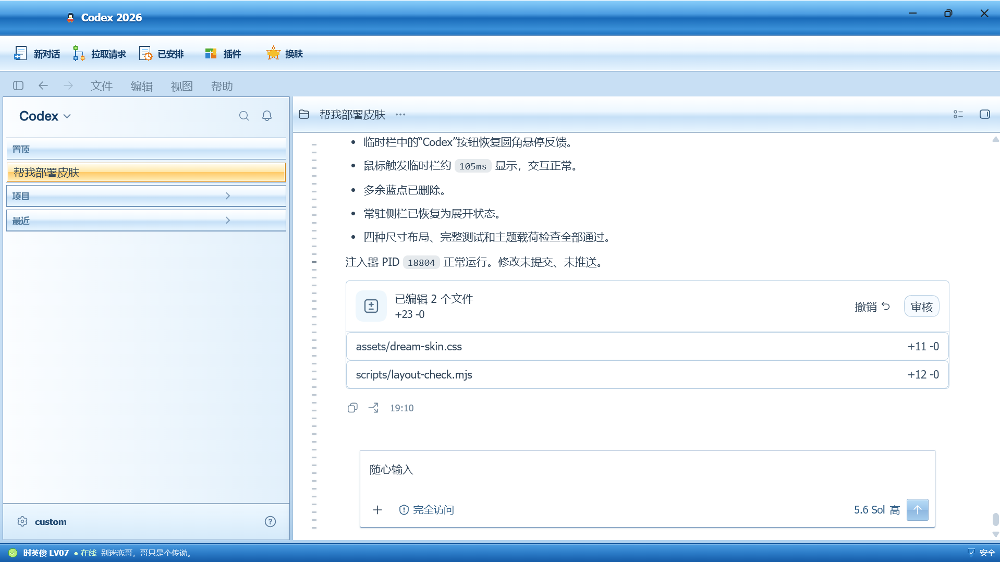

# Codex One-Click Skin

Windows Codex 桌面端的一键换肤工具。它通过可逆的渲染层注入应用图片主题，同时保留 Codex 的真实输入框、附件、导航、任务操作、菜单和侧栏交互。



当前版本：`v1.8.0`

## 功能

- 内置 QQ2007 复古版、樱粉晨曦、午夜极光、赛博霓虹、森野薄雾和琥珀黄昏主题。
- 从 JPG、PNG 或 WebP 图片生成主题，并立即应用到当前 Codex 会话。
- 在顶部“换肤”菜单中切换主题或返回 Codex 官方外观。
- 保留原生输入、图片附件、审阅、模型菜单、项目导航和任务操作能力。
- 支持常驻侧栏、折叠状态、鼠标临时栏、摘要栏和附件二级面板。
- Codex 页面重载或路由变化后自动恢复当前主题。
- 安装、验证和恢复均不修改 `WindowsApps`、`app.asar`、应用签名、账号凭据或 API 配置。

## 环境要求

- Windows 10/11
- Microsoft Store 安装的官方 OpenAI Codex 桌面端
- Node.js 22 或更高版本
- Windows PowerShell 5.1 或 PowerShell 7

## 快速开始

1. 关闭 Codex，双击 `install.cmd`。
2. 桌面会出现“Codex 一键换肤”和“Codex 一键换肤 - 启动”。
3. 打开“Codex 一键换肤”，选择内置主题或导入自己的图片。

如果安装过其他非官方皮肤，请先使用对应恢复流程还原 Codex 官方外观，再安装本项目。

也可以在 PowerShell 中运行：

```powershell
powershell -NoProfile -ExecutionPolicy Bypass -File .\scripts\install-dream-skin.ps1
powershell -NoProfile -ExecutionPolicy Bypass -File .\scripts\theme-picker.ps1
```

首次应用主题时，Codex 需要重启一次来启用仅限本机回环地址的调试端口。重启可能丢失尚未发送的输入，脚本会先征求确认。

## 导入图片

打开桌面“Codex 一键换肤”，点击“导入图片”并选择文件即可。也可直接运行：

```powershell
powershell -NoProfile -ExecutionPolicy Bypass -File .\scripts\import-theme.ps1 `
  -ImagePath C:\Pictures\my-skin.png -Name "我的主题"
```

图片会复制到 `%LOCALAPPDATA%\CodexOneClickSkin\themes`。渲染器会分析图片色彩并生成主题参数，界面控件仍由 Codex 原生 DOM 提供。

## 常用命令

```powershell
# 查看主题
.\scripts\list-themes.ps1

# 切换主题并立即应用
.\scripts\switch-theme.ps1 -ThemeId preset-sakura-dawn

# 启动当前主题
.\scripts\start-dream-skin.ps1 -PromptRestart

# 截图并验证当前会话
.\scripts\verify-dream-skin.ps1 -ScreenshotPath .\verify.png

# 恢复官方外观
.\scripts\restore-dream-skin.ps1 -RestoreBaseTheme -PromptRestart

# 卸载快捷方式并恢复
.\scripts\restore-dream-skin.ps1 -Uninstall -RestoreBaseTheme -PromptRestart
```

## 主题格式

每个主题位于 `presets/<id>/` 或本地主题库中的独立目录：

```text
theme.json
background.jpg
assistant.png   # 可选
qq-show.png     # 可选
```

`theme.json` 至少需要：

```json
{
  "schemaVersion": 1,
  "id": "my-theme",
  "name": "我的主题",
  "image": "background.jpg",
  "appearance": "auto",
  "art": { "focusX": 0.5, "focusY": 0.5, "safeArea": "auto" }
}
```

主题 id 只允许英文字母、数字、下划线和连字符。单张图片上限为 16 MB，载荷构建器会检查文件名、扩展名、图片签名、大小和重复 id。

## 质量约束

项目对 `1438×600`、`1282×720`、`960×720` 和 `720×800` 四档视口执行自动布局检查。发布版本必须满足：

- 标题栏、工具栏、内容区和状态栏互不遮挡。
- 常驻侧栏、临时栏、摘要栏和附件栏均保持在内容边界内。
- 输入框高度稳定，输入、附件和提交操作不引发布局跳动。
- 标签、菜单、附件、展开、收回和二级控件保持原生交互。
- 所有可见按钮的中心点必须命中对应的真实控件。
- `hover`、键盘焦点、展开、选中和按下状态必须有一致的视觉反馈。

完整工程约束见 [质量与交互约束](docs/quality-constraints.md)。

## 安全边界

本项目通过 Chrome DevTools Protocol 连接 `127.0.0.1` 上由当前官方 Codex 进程持有的端口。脚本会校验 Store 包身份、可执行文件路径、监听进程、浏览器会话 id 和页面目标，不连接远程调试端点。

恢复操作会停止注入进程、移除实时样式、关闭调试会话并重新打开官方 Codex。用户主题与选择记录位于 `%LOCALAPPDATA%\CodexOneClickSkin`。

## 验证

```powershell
powershell -NoProfile -ExecutionPolicy Bypass -File .\tests\run-tests.ps1
node .\scripts\injector.mjs --check-payload --theme-dir .\presets\preset-codex-1907-deep
node .\scripts\layout-check.mjs 9335
```

## 许可

代码按 MIT License 发布。Codex 和 OpenAI 是其各自权利人的商标；本项目是非官方界面定制工具，不包含或重新分发 Codex 应用程序。
